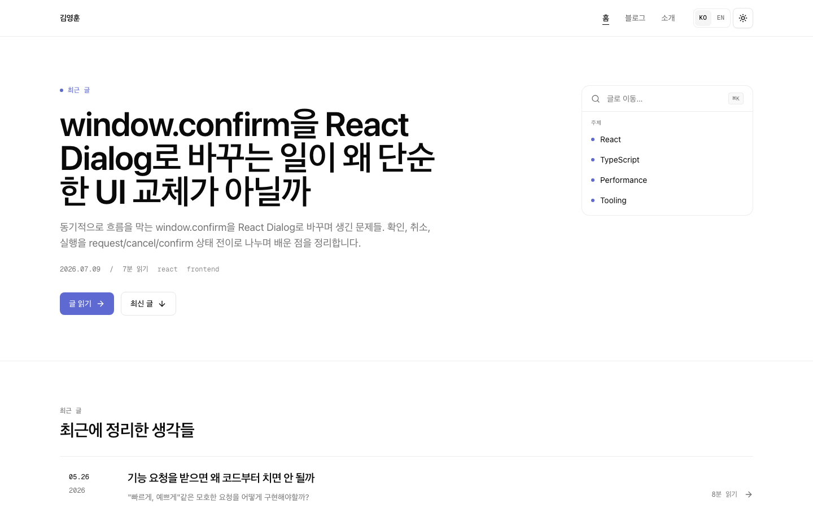

# 김영훈 기술 블로그

React와 TypeScript로 제품 문제를 해결하며 배운 내용을 기록하는 개인 기술 블로그입니다.

[블로그 바로가기](https://www.joseph0926.com) · [English](https://www.joseph0926.com/en)

[](https://github.com/joseph0926/blog/actions/workflows/ci.yml)
[](https://nextjs.org/)
[](https://react.dev/)
[](https://www.typescriptlang.org/)
[](https://pnpm.io/)



## 주요 기능

- 한국어·영어 라우팅과 콘텐츠 제공, 영어 번역이 없을 때 한국어 원문으로 대체
- 저장소의 MDX 파일을 기반으로 한 글 목록, 상세 페이지, 읽기 시간 계산
- 제목·설명 검색과 주제·연도 필터를 URL에 동기화해 공유 가능한 탐색 상태 제공
- React 예제와 시뮬레이터 같은 인터랙티브 컴포넌트를 MDX에서 지연 로드
- 글별 메타데이터, 언어 대체 링크, JSON-LD, sitemap, robots 설정 제공
- 반응형 레이아웃, 다크 모드, 본문 바로가기 링크 지원

## 기술 구성

| 영역         | 기술                                                                    |
| ------------ | ----------------------------------------------------------------------- |
| 애플리케이션 | Next.js 16 App Router, React 19, TypeScript 6                           |
| 콘텐츠       | MDX, `next-mdx-remote`, `gray-matter`, `remark-gfm`, `rehype-highlight` |
| 데이터       | tRPC, TanStack Query, Zod                                               |
| UI           | Tailwind CSS 4, Radix UI, Motion                                        |
| 다국어       | `next-intl`, `date-fns`                                                 |
| 품질         | Vitest, Playwright, ESLint, Prettier, GitHub Actions                    |
| 워크스페이스 | pnpm 11, Turborepo 2                                                    |

## 프로젝트 구조

```text
.
├── apps/blog
│   ├── messages/          # 한국어·영어 UI 문구
│   ├── public/            # 로고와 글 이미지
│   └── src
│       ├── app/           # App Router, API, SEO 엔드포인트
│       ├── components/    # 페이지·도메인 컴포넌트
│       ├── mdx/           # 글과 인터랙티브 MDX 컴포넌트
│       ├── server/trpc/   # tRPC 서버
│       └── services/      # MDX 조회와 콘텐츠 변환
├── packages/ui/           # 공유 UI 컴포넌트
├── e2e/                   # Playwright 브라우저 테스트
└── scripts/verify.sh      # 전체 검증 스크립트
```

## 로컬 실행

Node.js 24와 pnpm 11.15.1 이상이 필요합니다. 저장소 루트에서 실행합니다.

```sh
fnm use
corepack enable
pnpm install
pnpm dev
```

개발 서버는 [http://localhost:3000](http://localhost:3000)에서 열립니다. 기본 로컬 실행에 필수 환경 변수는 없습니다.

## 명령어

| 명령어                                                        | 설명                                           |
| ------------------------------------------------------------- | ---------------------------------------------- |
| `pnpm dev`                                                    | Turborepo 개발 서버 실행                       |
| `pnpm build`                                                  | 전체 워크스페이스 빌드                         |
| `pnpm type-check`                                             | TypeScript 타입 검사                           |
| `pnpm --filter @joseph0926/blog lint`                         | 블로그 ESLint 검사                             |
| `pnpm --filter @joseph0926/blog format:check`                 | 블로그 포맷 검사                               |
| `pnpm --filter @joseph0926/blog test:ci`                      | Vitest 단위·통합 테스트 실행                   |
| `pnpm exec playwright test --config=e2e/playwright.config.ts` | Playwright E2E 테스트 실행                     |
| `pnpm lint:fix`                                               | 전체 워크스페이스 ESLint 자동 수정             |
| `./scripts/verify.sh`                                         | lint, format, typecheck, test, build 순차 검증 |

## 글 작성

글은 `apps/blog/src/mdx`에 추가합니다. 한국어 원문은 `YYYY-MM-DD-{slug}.mdx`, 영어 번역은 같은 이름의 `YYYY-MM-DD-{slug}.en.mdx`를 사용합니다.

```mdx
---
slug: '2026-07-10-example-post'
title: '글 제목'
description: '목록과 검색 결과에 표시할 설명'
date: '2026-07-10'
tags: ['react', 'typescript']
thumbnail: '/post/example.webp'
---

# 글 제목
```

- `thumbnail`과 `updatedAt`은 선택 항목입니다.
- 썸네일은 `apps/blog/public/post`에 저장하고 `/post/{파일명}`으로 참조합니다.
- 새 인터랙티브 컴포넌트는 `apps/blog/src/mdx/components`에 만들고 `component-registry.ts`에 등록합니다.

## 선택 환경 변수

| 변수                 | 용도                                                 |
| -------------------- | ---------------------------------------------------- |
| `ANALYZE=true`       | 빌드 시 번들 분석기 활성화                           |
| `BLOG_PERF_DEBUG=1`  | 서버의 MDX 조회 성능 로그 활성화                     |
| `BLOG_PERF_LOG_PATH` | 성능 로그 경로 변경. 기본값은 `.perf/perf-log.jsonl` |

배포 환경 판별에는 Vercel이 제공하는 `VERCEL_ENV`를 사용합니다.

## 연락

- [GitHub](https://github.com/joseph0926)
- [LinkedIn](https://www.linkedin.com/in/joseph0926)
- [Email](mailto:joseph0926.dev@gmail.com)
