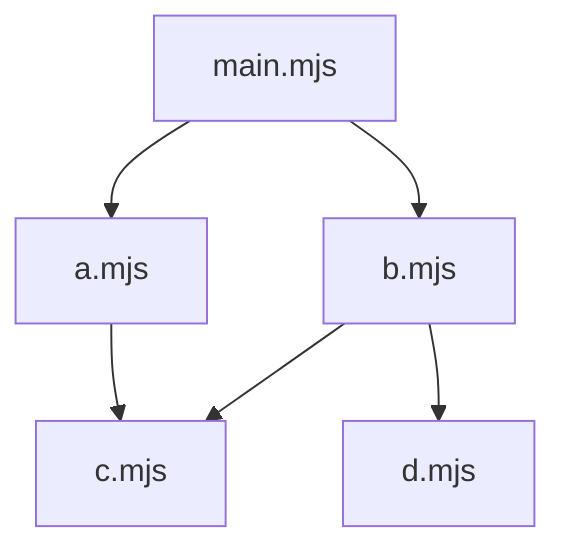

# 12. ESM 로딩 3단계 대화 복습 로그

[← 목차로 돌아가기](./README.md) | [← 이전: 퀴즈 복습 노트 2차](./11-quiz-review-2.md)

---

> 목적: 실제 Q&A 흐름과 이해 교정을 그대로 복습하기 위한 로그형 문서

---

## 대화 흐름 (질문 → 답변 → 이해 확인)

### 1) "ESM 로딩 3단계를 용어까지 알아야 하나?"

**질문**

> 용어까지 알아야 하는 이유가 뭔가요?

**답변 요지**

- 용어를 알아야 문제를 단계별로 정확히 분리해 설명/디버깅할 수 있음
- `Construction`: 모듈 그래프/해결 문제
- `Instantiation`: import/export 연결 문제
- `Evaluation`: 실행 순서/부작용 문제

**복습 포인트**

- 암기 목적이 아니라, 원인 분석 좌표를 맞추는 목적

---

### 2) "그래프는 미리 만들까, 로드 시작 후 만들까?"

**질문**

> ESM은 로드 시작되면 그래프를 구축하나요? 미리 구축하나요?

**답변 요지**

- 네이티브 ESM(Node/브라우저)은 보통 로드 시작 후 Construction에서 그래프 구축
- 이미 로드된 모듈은 캐시 재사용
- 번들러 빌드에서는 그래프를 미리 분석 가능

**이해 확인**

> 이미 로드되면 대부분 캐시를 사용하고, 변경 적용하려면 새로 로드해야 한다?

**확인 답변**

- 맞음 (보통 프로세스 재시작 또는 다른 specifier로 새 로드)

---

### 3) "캐시 범위는 어디까지인가?"

**질문**

> 구조 동일/내용 변경, 파일 추가, 의존성 삭제일 때 캐시가 어떻게 되나요?

**답변 요지 (Node ESM 기준)**

| 케이스                    | 같은 specifier import     | 새 specifier import |
| ------------------------- | ------------------------- | ------------------- |
| 파일 내용만 변경          | 기존 캐시 재사용 (미반영) | 변경 반영           |
| 구조 동일 + 파일 1개 추가 | 기존 캐시 재사용 (미반영) | 변경 반영           |
| 마지막 의존성 삭제        | 기존 캐시 재사용 (미반영) | 삭제 반영           |

**복습 포인트**

- 캐시 키는 해석된 URL 전체
- 쿼리(`?v=2`)가 다르면 다른 모듈로 취급

---

### 4) "브라우저 새로고침 시에는?"

**질문**

> 브라우저는 새로고침하면 어떤가요?

**답변 요지**

- 페이지 리로드 시 실행 컨텍스트는 새로 시작
- 다만 네트워크는 HTTP 캐시 영향 (`from cache`, `304`)
- Hard Reload는 일반 새로고침보다 캐시를 더 강하게 우회

**복습 포인트**

- 실행 재시작과 네트워크 캐시는 구분해서 보기

---

### 5) "모듈 그래프는 어떻게 만드나?"

**질문**

> Construction 과정을 살펴봅시다.

**답변 요지**

1. 엔트리 모듈 시작
2. 정적 import/export from 파싱
3. specifier를 실제 식별자로 resolve
4. Module Record 생성
5. 의존성 간선 추가
6. 신규 모듈이 없어질 때까지 반복

**복습 포인트**

- 정적 import가 초기 그래프 대상
- `import()`는 실행 중에 그래프 확장

---

### 6) "`resolve`의 실제 주소가 뭔가?"

**질문**

> 실제 주소(URL/파일 경로)라는 게 정확히 뭔가요?

**답변 요지**

- 런타임이 확정한 최종 식별자
- 예: 브라우저 `https://...`, Node `file:///...`, 내장 `node:fs`
- 이 식별자가 로딩 대상이자 캐시 키

---

### 7) "Module Record/간선 추가는 실제로 어떻게?"

**질문**

> "노드 만들고 A -> B 간선 추가"가 구체적으로 어떻게 되나요?

**답변 요지**

```text
moduleMap: Map<resolvedURL, ModuleRecord>

loadModule(specifier, parentURL):
  1) resolve
  2) moduleMap 조회/재사용
  3) 없으면 파싱 후 ModuleRecord 생성
  4) 자식 모듈 재귀 처리
  5) parent.dependencies에 child 추가
```

**복습 포인트**

- URL 기준으로 노드 1개 유지
- 순환 참조 대응을 위해 Record를 먼저 등록

---

### 8) "시각화로 보여달라"

**질문**

> 조금 더 이해하기 쉽게 시각화해줄 수 있나요?

**답변 예시**

```javascript
// main.mjs
import './a.mjs';
import './b.mjs';

// a.mjs
import './c.mjs';

// b.mjs
import './c.mjs';
import './d.mjs';
```



**확인 포인트**

- `c.mjs`는 중복 생성되지 않고 재사용

---

### 9) "실생활 비유로 Construction"

**질문**

> Construction을 실생활 비유로 설명 가능한가요?

**답변 요지**

- 여행 계획 비유:
  - Construction = 지도/경로 설계
  - Evaluation = 실제 이동

**사용자 피드백**

> 여행 비유로는 Construction과 Instantiation 분리가 잘 안된다.

**교정 답변**

- 레벨로 분리:
  - Construction = 파일/모듈 레벨 지도 작성
  - Instantiation = 이름/바인딩 레벨 배선 연결
  - Evaluation = 실행

---

### 10) "Instantiation는 정확히 뭘 하나?"

**질문**

> 설계서를 보고 실제 연결하는 준비 과정인가요?

**답변 요지**

- 맞음
- import/export 바인딩 연결
- 없는 export import 여부 검사
- 실행 전 링크 무결성 확인

---

### 11) "사용자 이해 정리와 검증"

**사용자 정리 1**

> Construction은 설계서 작성, Instantiation은 설계서를 보고 실제 연결하여 실행 준비

**검증**

- 정확함

**사용자 정리 2**

> 장벽은 Instantiation 이후, Evaluation 이전에 생긴다

**검증**

- 정확함 (철자: `Instantiation`)

**사용자 정리 3**

> Construction은 모듈 탐색 실패, Instantiation은 이름 불일치 에러  
> `import()`는 실행 중에 확정

**검증**

- 정확함

---

### 12) 최종 이해 점검

**질문**

> 이 정도면 3단계를 이해했다고 봐도 될까요?

**답변**

- 이해했다고 봐도 됨
- 최종 체크 2개:
  - 단계별 대표 에러를 말로 구분 가능?
  - `import()`가 초기 정적 그래프가 아니라 실행 중 확장임을 설명 가능?

---

## 최종 한 줄

`Construction`은 "무엇을 가져올지 지도 작성", `Instantiation`은 "가져온 것을 어떻게 연결할지 배선", `Evaluation`은 "실제로 실행"입니다.

---

_작성일: 2026-02-09_  
_업데이트: 2026-02-09 (Q&A 로그형 재작성)_
